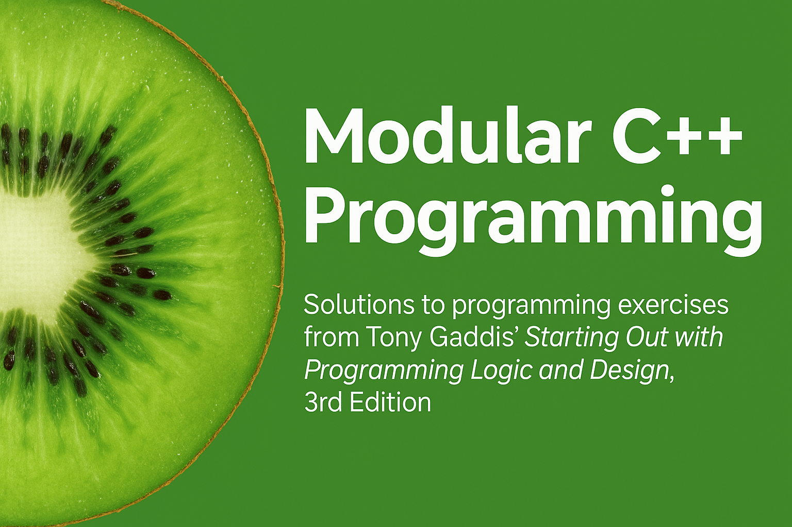
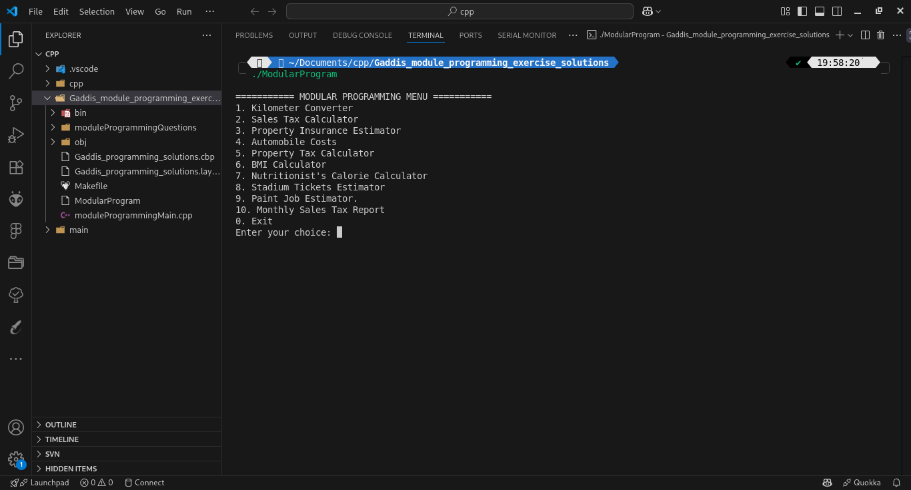

# 🧠 Modular C++ Programming
Solutions to modular programming exercises from **Tony Gaddis' _Starting Out with Programming Logic and Design, 3rd Edition_**.



## 📚 Description
This project is a collection of beginner-to-intermediate level programming exercises implemented in **C++**, with a focus on **modular program design**. Each exercise is split into `.h` and `.cpp` modules and tied together in a menu-driven `main.cpp` file.

---

## 📂 Folder Structure

```
.
├── moduleProgrammingQuestions/
│   ├── moduleProgrammingQuestion1.cpp / .h
│   ├── ...
├── moduleProgrammingMain.cpp
├── Makefile
└── README.md
```

---

## 🛠 Features

- ✔️ Clean modular structure
- ✔️ Real-world problem simulation (e.g., BMI calculator, Property tax, Paint job estimator)
- ✔️ Menu-based user interface
- ✔️ Compile automation with Makefile
- ✔️ Input validation and formatted outputs

---

## 🔧 Build Instructions

### ✅ Compile using Makefile
```bash
make
```

### 🏃 Run the program
```bash
./ModularProgram
```

### 📦 Clean build files
```bash
make clean
```

> Ensure you're using a C++17+ compatible compiler (`g++`, `clang++`, etc.)

---

## 📸 Preview



---

## 💡 Motivation

This project was built as part of my coursework to apply and reinforce core programming concepts:
- Modularization
- Function usage
- Arithmetic processing
- Input/output validation

---

## 📘 Reference

Textbook:  
**_Starting Out with Programming Logic and Design, 3rd Edition_**  
by Tony Gaddis

---

## 🙌 Contributions

Contributions or feedback are welcome. Open an issue or a pull request if you'd like to suggest improvements.

---

## 📜 License

For educational use only.
=======
# Modular_Programming_Projects
💡 Modular C++ solutions to programming exercises from "Starting Out with Programming Logic and Design, 3rd Edition" by Tony Gaddis. Includes a menu-driven console interface, Makefile, and modular file structure.
>>>>>>> 026c713670716bef95db5cfb8ad7a1ba7783cc95
